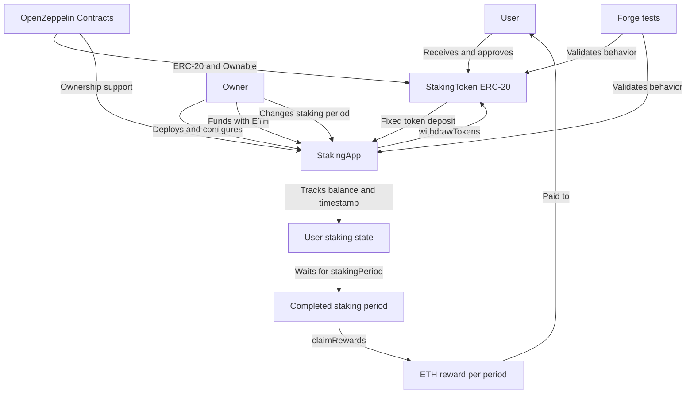

# Staking Dapp

A simple staking protocol built with Solidity and Foundry. Users deposit a fixed amount of an ERC-20 staking token and earn ETH rewards after completing a configured staking period. The project demonstrates the core mechanics of a time-based staking application, including token deposits, reward claims, withdrawals, ownership controls, and automated smart contract testing.

The protocol is composed of two contracts: `StakingToken`, an ERC-20 token used for testing, and `StakingApp`, the contract that manages deposits, staking periods, withdrawals, and ETH reward payments. OpenZeppelin Contracts provides the ERC-20 and ownership implementations used by the project.

## Features

- ERC-20 `StakingToken` with a mint function for local testing.
- Fixed-amount deposits for each user.
- ETH rewards after each completed staking period.
- Withdrawal of the user's deposited tokens.
- Owner-only administration for funding rewards and changing the staking period.
- Automated tests using Forge and OpenZeppelin Contracts.

## Project Structure

- `src/StakingApp.sol`: main staking and reward contract.
- `src/StakingToken.sol`: ERC-20 token used for staking tests.
- `test/`: unit tests for both contracts.
- `lib/`: Foundry and OpenZeppelin dependencies managed as submodules.

## Project Concept Map



The main relationship is between the user, the ERC-20 token, and the staking contract. The user deposits tokens into `StakingApp`, waits for the configured period, and receives an ETH reward. The owner supplies the reward liquidity and manages the protocol configuration, while the Forge test suite validates the expected contract behavior.

## How It Works

1. The owner deploys `StakingToken` and `StakingApp` with the desired staking configuration.
2. A user receives staking tokens and approves `StakingApp` to transfer them.
3. The user deposits the exact fixed amount required by the contract.
4. After the configured period has elapsed, the user claims the ETH reward.
5. The user can withdraw the deposited tokens.

Each address can have one active deposit at a time. Claiming a reward resets that user's timer, so another reward can only be claimed after a new full staking period. The contract must be funded with ETH by the owner before users can claim rewards.

## Requirements

- [Foundry](https://book.getfoundry.sh/getting-started/installation)
- Git

## Getting Started

Clone the repository and initialize its submodules:

```shell
git clone https://github.com/Vir0822/Staking-Dapp.git
cd Staking-Dapp
git submodule update --init --recursive
forge install
forge build
forge test
```

Format the Solidity code with:

```shell
forge fmt
```

## Configuration

- `stakingPeriod`: required waiting time between deposits and reward claims.
- `fixedStakingAmount`: exact amount of ERC-20 tokens required for a deposit.
- `rewardPerPeriod`: ETH reward paid for each completed staking period.

## Disclaimer

This is an educational and experimental project. The contracts have not been professionally audited and should not be used with real funds without a thorough security review.

### Author

[Virginia Villela](https://github.com/Vir0822)

**Blockchain Developer**
